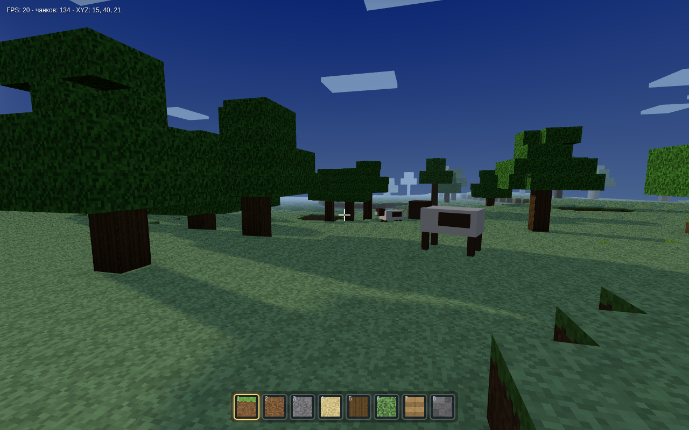

# MineKopatel ⛏️

Воксельный «майнкрафт»-клон, целиком в **одном HTML-файле** — без сборки, без зависимостей, без сервера. Просто открой `index.html` в браузере.

🎮 **Играть онлайн:** https://kanatdev247.github.io/MineKopatel/

## Возможности (MVP)

- 🌍 **Бесконечный мир** — процедурная генерация: равнины, горы, озёра, песчаные берега, снежные вершины, леса
- 🧱 **Подгрузка чанков** — мир строится вокруг игрока на лету и выгружается за горизонтом
- ⛏️ **Ломай и строй** — ЛКМ/ПКМ, 8 видов блоков в хотбаре (1–8 или колесо мыши)
- 🐄 **Животные** — коровы, свиньи и куры бродят по миру
- ☀️ **Цикл дня и ночи** — рассветы, закаты, движущееся солнце
- ✨ **Графика** — мягкие тени (PCF), ambient occlusion по вершинам, туман, анимированная вода, облака; режим «Быстро» для слабых машин
- 💾 **Сохранение** — твои постройки запоминаются в браузере (localStorage)

## Управление

| Клавиша | Действие |
|---|---|
| WASD | движение |
| Пробел | прыжок / всплыть |
| Shift | бег |
| ЛКМ / ПКМ | сломать / поставить блок |
| 1–8, колесо | выбор блока |
| Esc | пауза |

## Технологии

Один файл `index.html` (~1.3 МБ): three.js встроен прямо в файл, текстуры генерируются процедурно на Canvas. Работает офлайн.

Требуется браузер с включённым WebGL.
